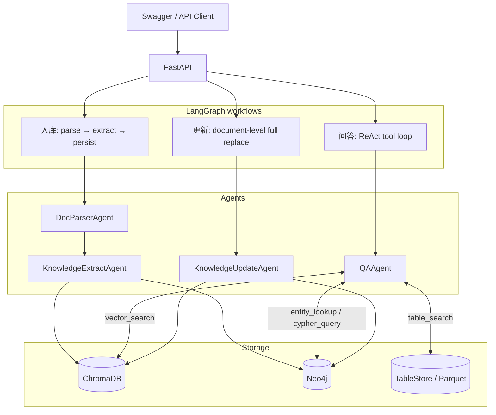

# Agent Knowledge Hub

[](https://www.python.org/)
[](https://langchain-ai.github.io/langgraph/)
[](https://docs.docker.com/compose/)
[](https://github.com/Shea-yy/agent-knowledge-hub/actions/workflows/ci.yml)

一个面向企业文档的 Agentic Knowledge Hub 原型：文档入库时构建向量索引与知识图谱；提问时由受约束的 ReAct Agent 选择向量、图谱或表格工具，并返回答案、可追溯证据和工具轨迹。

> 这是 Python 后端项目，重点展示 Agent 工程化。

## 架构



## 当前实现的能力

| 场景 | 实现方式 | 可验证结果 |
|---|---|---|
| 文档入库 | 解析 PDF、图片、TXT、Markdown 与表格；文本进入向量库和图谱 | `POST /api/ingest/upload` 返回 chunk、实体和关系统计 |
| 表格查询 | CSV/Excel 走 Parquet + 精确查询，不把行数据当普通 RAG chunk | `list_tables`、`table_info`、`table_search` |
| 智能问答 | LangGraph `create_agent` ReAct 循环，使用 6 个工具 | 返回 `answer`、`sources`、`reasoning_steps`、`thread_id` |
| 证据与会话 | 只从本轮 ToolMessage 提取证据和答案；每个匿名问题自动生成会话与轮次 ID | 不会在本轮失败时返回上一轮答案 |
| Cypher 安全 | 只允许 `MATCH ... RETURN ... LIMIT 1..50`，限制长度、写操作、多语句与超时 | AOP 单测覆盖非法查询和熔断行为 |
| 文件更新 | 同名文件使用安全的文档级 `full_replace`，覆盖失败可恢复本地旧文件 | 不会把不可靠的行级 diff 包装成 CDC |
| 交付 | Docker Compose、非 root API 镜像、真实依赖健康检查、GitHub Actions | 本地验证三容器 healthy，`/api/health` 为 `ok` |

## 快速开始

### 前置条件

- Docker Desktop
- OpenAI 兼容 API 的有效 Key（完成真实入库和问答所需）

```bash
git clone https://github.com/Shea-yy/agent-knowledge-hub.git
cd agent-knowledge-hub
cp python/.env.example python/.env
```

编辑 `python/.env`，至少设置：

```env
OPENAI_API_KEY=your-key
OPENAI_BASE_URL=https://api.openai.com/v1
OPENAI_MODEL=gpt-4o
EMBEDDING_MODEL=text-embedding-3-small
```

启动服务：

```bash
docker compose --env-file python/.env up --build -d
```

验证状态：

```bash
curl http://localhost:8080/api/health
```

预期 `status` 为 `ok`，且 Neo4j、向量库均为 `connected`。随后访问：

- Swagger：`http://localhost:8080/docs`
- Neo4j Browser：`http://localhost:7474`
- Chroma：`http://localhost:8000`

Windows PowerShell 中可用：

```powershell
Copy-Item python\.env.example python\.env
docker compose --env-file python\.env up --build -d
Invoke-RestMethod http://localhost:8080/api/health
```

## 五分钟手测

1. 在 Swagger 执行 `GET /api/health`。
2. 上传一份 TXT、Markdown 或 PDF 到 `POST /api/ingest/upload`。
3. 在 `POST /api/qa/ask` 中只提交 `question`；省略或设为 `null` 的 `thread_id` 会由服务端生成。
4. 检查 `answer` 是否基于文档，`sources` 是否指向上传文件，`reasoning_steps` 是否只包含工具轨迹。
5. 将响应的 `thread_id` 带入下一问，验证多轮上下文；更新同名文件后用新会话验证旧证据已被替换。

例如上传如下内容后提问：

```text
北京地区住宿标准上限为每晚500元。
员工应在出差结束后的10个工作日内提交报销申请。
```

```json
{"question": "北京地区住宿标准是多少？报销期限是多久？"}
```

答案应包含“500 元”和“10 个工作日”，并在 `sources` 中给出文档片段。

## API 一览

| Method | Path | Purpose |
|---|---|---|
| `GET` | `/api/health` | 检查 API、Neo4j、Chroma 和工作流状态 |
| `POST` | `/api/ingest/upload` | 上传并入库单个文档 |
| `POST` | `/api/ingest/batch` | 批量上传，默认最多 10 个文件 |
| `GET` | `/api/files` | 列出上传文件及来源统计 |
| `PUT` | `/api/files/{filename}` | 安全替换同名文件并全量重建该文档索引 |
| `DELETE` | `/api/files/{filename}` | 删除磁盘文件、向量、图谱与表格数据 |
| `POST` | `/api/qa/ask` | 执行带证据的 ReAct 问答 |
| `GET` | `/api/admin/stats` | 查看向量库与图谱统计 |

上传仅允许 `.pdf`、`.png`、`.jpg`、`.jpeg`、`.csv`、`.xlsx`、`.xls`、`.txt`、`.md`；默认单文件上限 20 MB。

## 测试与交付验证

```powershell
cd python
& 'D:\AnacondaEnvs\agent-kb\python.exe' -B -m pytest tests -p no:cacheprovider -q -k "not test_upload_txt"
```

当前确定性回归结果为：`113 passed, 1 deselected`。被排除的旧 `test_upload_txt` 会触发真实入库/LLM，不能作为稳定 CI 质量指标。

GitHub Actions 会安装开发依赖、执行 `pip check`、编译检查，并运行同一组确定性测试。Docker Compose 已在本地完成镜像构建、容器健康检查和 `/api/health` 端到端验证。

## 代码地图

```text
python/
├── agents/
│   ├── qa_agent.py                 # ReAct 工具、证据解析、会话边界
│   ├── doc_parser_agent.py         # 多格式文档解析
│   ├── knowledge_extract_agent.py  # 实体、关系与事件抽取
│   └── knowledge_update_agent.py   # 文档生命周期与 full_replace
├── api/main.py                     # FastAPI 生命周期、上传与文件 API
├── core/
│   ├── aop_interceptors.py         # Cypher 守卫与 ReAct 熔断
│   └── qa_evaluation.py            # 可重复执行的 QA 黄金集评估
├── orchestrator/graph.py           # 入库、问答、更新工作流
├── services/                       # Chroma、Neo4j、表格存储适配层
└── tests/                          # 单测、工作流回归、交付配置测试
```

## 已知边界与下一步

- `MemorySaver` 是进程内 checkpoint；重启后会话历史消失，尚未做多租户持久化记忆。
- `confidence` 是证据相关度的启发式汇总，不是答案正确率或概率校准。
- 目前是可靠的文档级 `full_replace`，不是 Chunk 级 CDC；Kafka/Watchdog 只是预留事件入口。
- Cypher 已限制为只读子集，但生产环境仍应加入身份认证、授权、审计、限流和更严格的查询资源控制。


## License

[MIT](./LICENSE)
